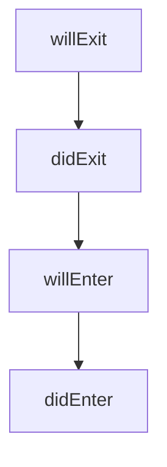

# @bm/runtime

Motor declarativo de experiencias para Beneficio Mutuo (BM). Implementa un runtime de escenas auditables, integrado con policies autoritativas, ARIA y telemetría sin exponer PII.

## Principios

- **Human-in-control**: todas las decisiones se evalúan con policies antes de ejecutar efectos.
- **Privacy-by-design**: DTOs redacted y obligaciones se propagan explícitamente.
- **Determinismo**: el core no realiza I/O directo; los efectos se inyectan vía adapters.

## Ciclo de vida de transición



1. `willExit`: se evalúan los guards `onExit` del nodo actual.
2. `didExit`: se emiten eventos/telemetría sobre la salida.
3. `willEnter`: se evalúan guards de la arista y del nodo destino.
4. `didEnter`: se actualiza el estado, se ejecutan acciones y se notifican UiDirectives.

## API Pública

### `ExperienceEngine`

```ts
const engine = new ExperienceEngine({
  graph,
  context,
  policies,
  sdk,
  aria,
  telemetry,
  storage,
});

await engine.transition("next-node-id");
await engine.next();
```

El engine mantiene `RuntimeState` inmutable y produce `TransitionResult` con errores tipados (`GuardDenyError`, `TransitionError`, etc.).

## Uso con React

```tsx
const provider = (
  <ExperienceRuntimeProvider graph={graph} context={context} adapters={{ policies, sdk, aria }}>
    <App />
  </ExperienceRuntimeProvider>
);
```

Hooks disponibles:

- `useExperienceRuntime()` → expone `state`, `transition`, `next` y errores globales.
- `useScene()` → retorna nodo actual y UiDirectives derivados.
- `useTransition(target)` → helper para disparar transiciones con `isPending`.

## Ejemplo de grafo

```ts
import { OnboardingGraph } from "@bm/runtime";
```

El grafo incluye escenas de `profile`, `moment`, `visibility`, `consent` y `review`, con guards que consultan policies y acciones que solicitan consentimiento.

## Tests

Ejecuta `pnpm test --filter @bm/runtime` o dentro del paquete `pnpm --filter @bm/runtime test`.
